author@Billadom0123
# WordPress官网如何写新文章

## 1.打开社团官网管理后台
  
如果未登录请先登录，建设期间开设临时管理员账号，账密请在技术部文档中获取。  
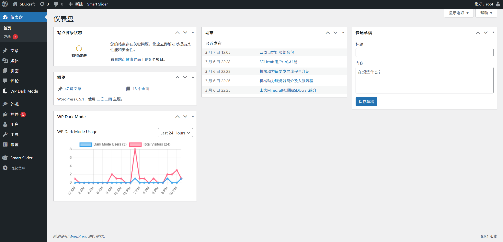 
  
如长期负责WordPress（下文简称WP或wp）后台运营，请自行给自己开一个管理员账户，无需打招呼。  
  
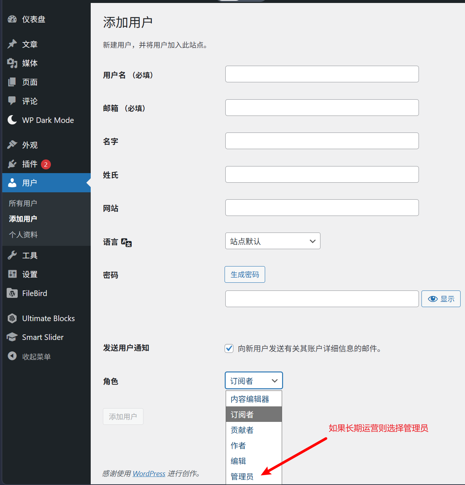

## 2. 找到左侧栏目中“文章” - “写文章”，即可开始写一篇新文章。
  
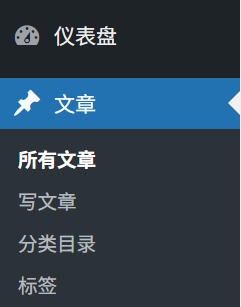

## 3. 新文章编辑界面，可以直接开始写文章

默认打开应该是下图的样子。

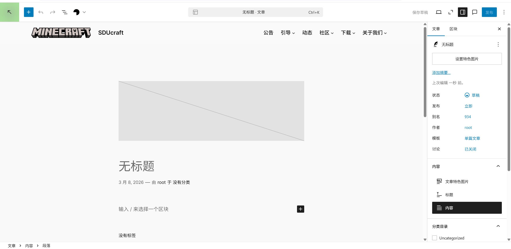

如果看到的不一样，可能是默认显示的模板不同，或者模板显示状态不同。  
模板建议用“单篇文章”，这个最适合社团文章编辑。其他的模板不实用，不建议用。  
怎么看自己当前用的什么模板？看下图。这里显示“单篇文章”，就对了。  

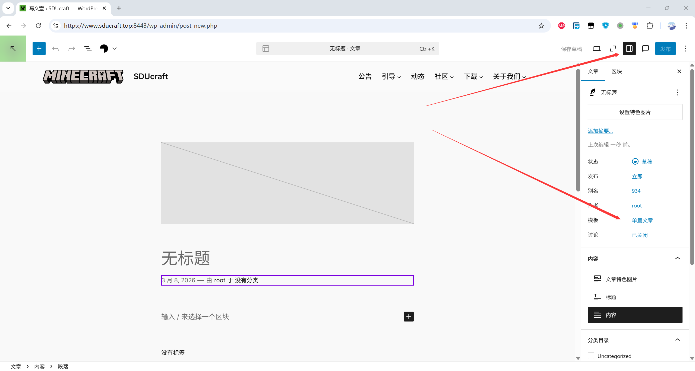

如果不是，再看下图，改过来。默认就是单篇文章模板，默认就对了。  

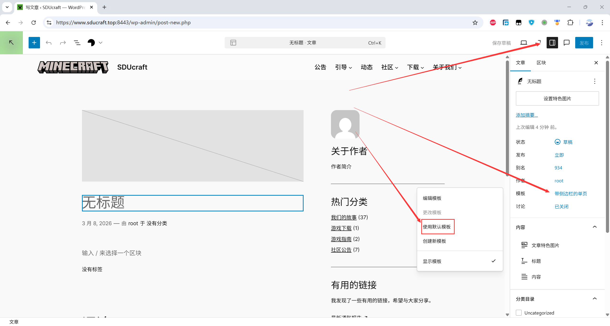

至于是否勾选“显示模板”，这个不影响编辑，只是个人风格喜好问题。如果对WP不是很熟，或者看着花里胡哨的，建议先不显示模板，这样更简洁。等后期熟悉了再开。  
后续演示均以不显示模板为例。  

## 4. 开始正式写文章。
我们最需要关注的是红色箭头这几个地方。  

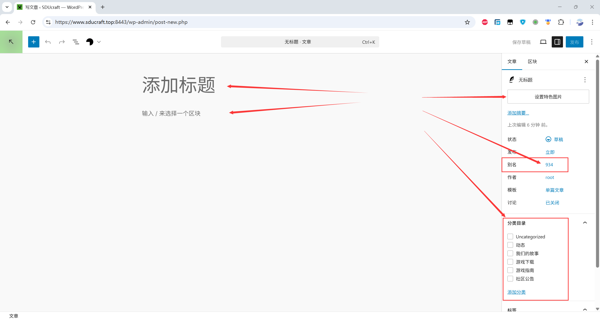

标题就是文章的名字，会显示在后台和发布后的文章列表，建议规范命名，简洁表述。后期可以改，但建议一步到位。  
内容的形式可以多样，WP支持很多种类的内容，例如纯文本、图片、视频、表格，他们都以区块的方式进行管理，看起来就是一块一块摞上去的。实际使用时可以先浏览一下所有区块种类，选择自己想要的，再进行编辑使用。  
左上可以打开文档概览，这个列表显示和大纲功能非常实用，一定要会用。  

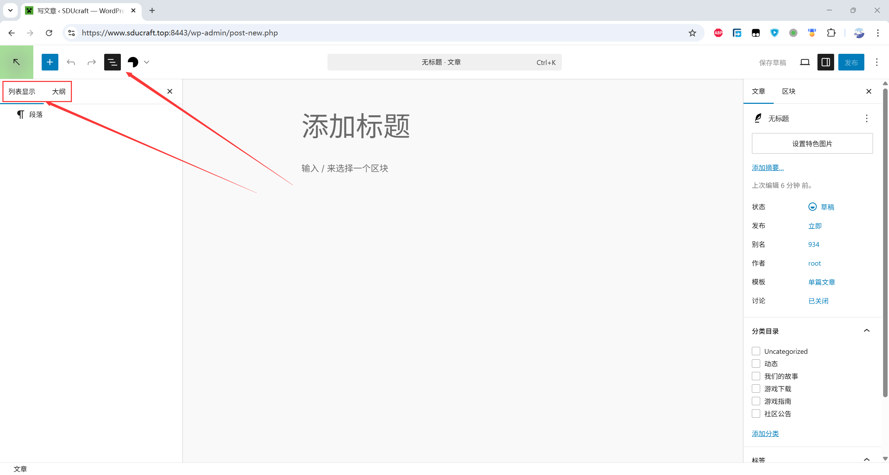

这里演示如何迁移一篇社团历史动态。  
原文网页如下，迁移第一篇《社团小游戏派对服务器开服啦！》

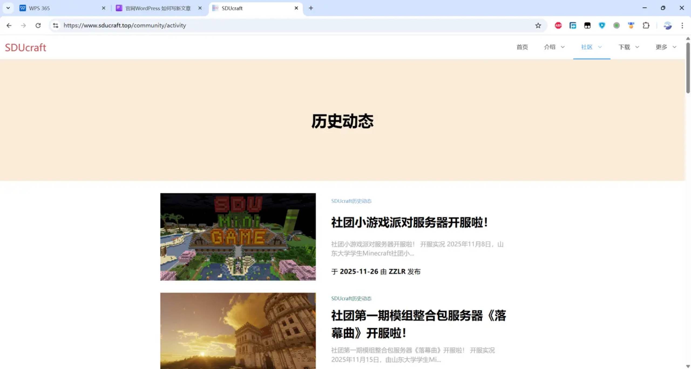
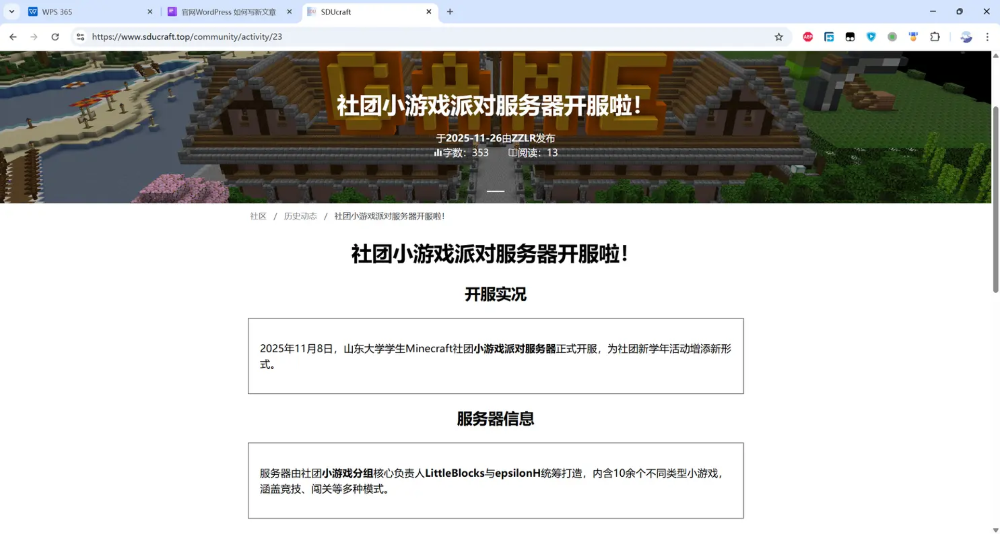

最简单方法，全部cv到wp里。wp会自动适配段落格式。标题单独cv。  

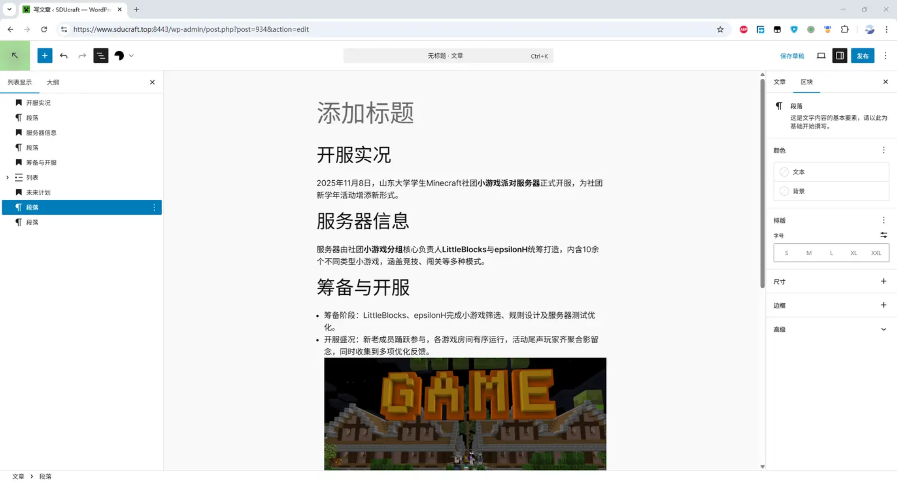

## 5. 细微调整，版面修复

然后做细微调整，例如“开服实况”这个标题太大，点击它，改成H3或者更小的格式。

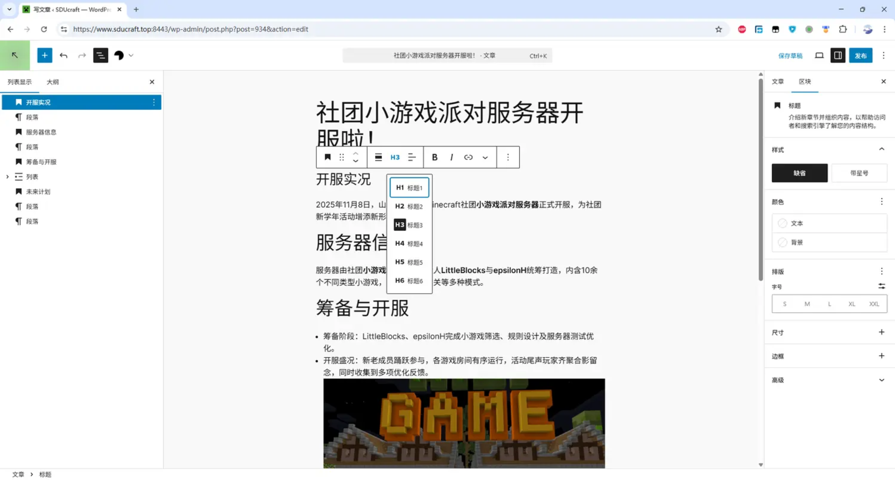

以此类推，整体效果差不多就行。  
注意，直接cv过来以后，有些图片状态是不对的，正确的图片，点击它，四周应该出现控件。如果不正确，你会感觉好像选不中它，如下图：

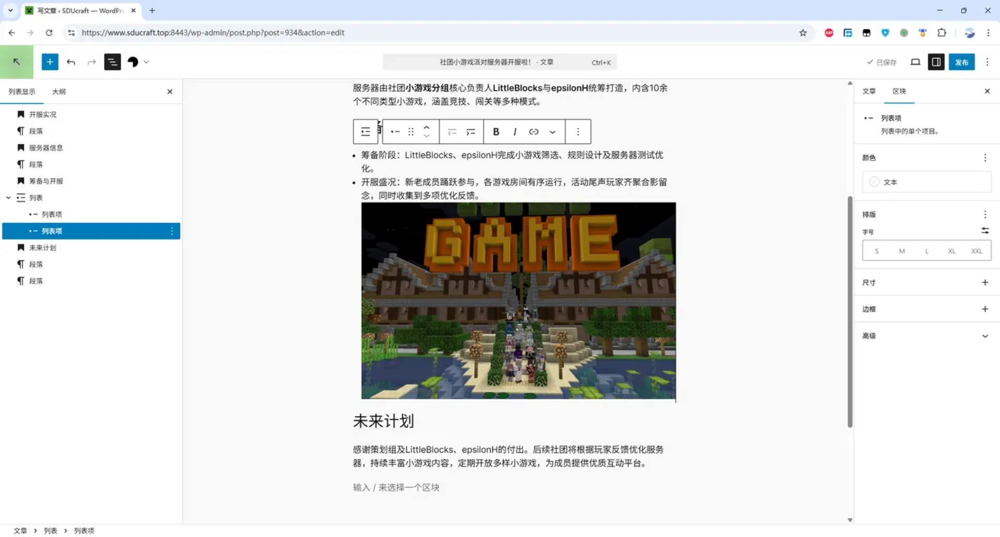

这是因为cv过来后图片变成了列表项的一部分，不再是单独的控件。  
这时候只能把这个图片删掉，再单独cv过来。

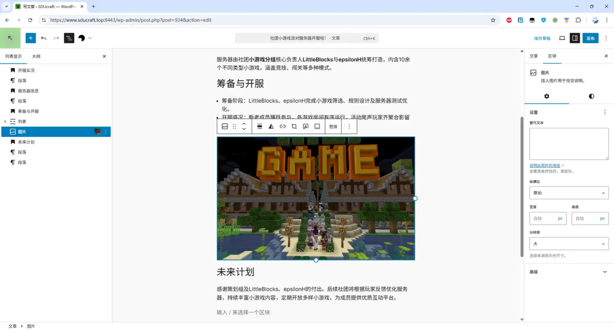

这样就对了。如果这一步不太会，可以直接在群里问，熟悉一次就好了。  
**之后需要注意，要去掉文章里面失效的超链接。最简单的办法是点击有超链接的文字，选择“移除链接”**

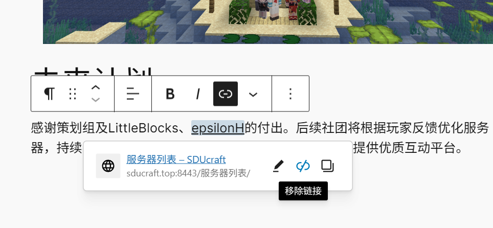

有时一些锚点超链接无法正常点出“移除链接”的选项，此时可以先随便给它一个超链接，即可选择移除链接。

## 6. 整理完毕之后，准备发布

注意选择一下**分类目录**，因为给出的例子是搬运历史动态，所以我们选**动态**，如果是正常文章则选择合适的分类。

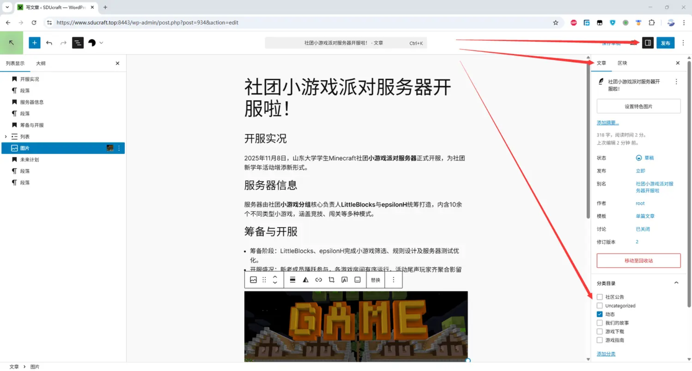

然后**设置头图**，用wp的特色图片功能进行设置。

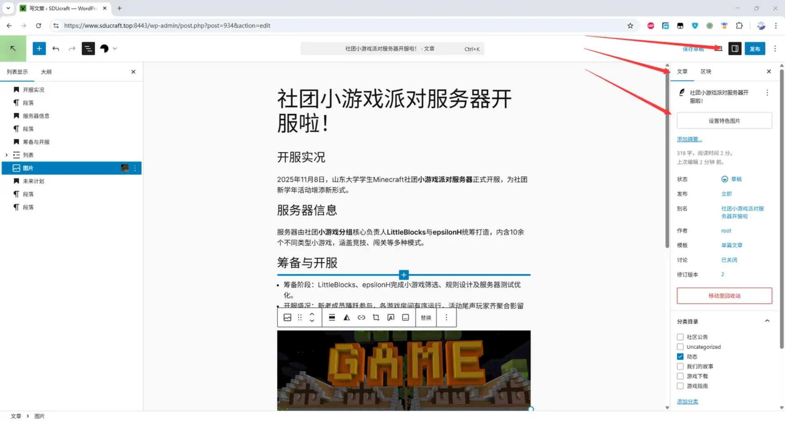

这里选上传文件或媒体库都行。一般我们要搬运的文章，头图都不在媒体库中，需要我们手动上传。**只能先把旧官网的文章的头图保存到本地，再上传到WP。**  
为减少劳动强度，可以直接从旧官网，用鼠标将图片拖动到桌面，浏览器自动保存，上传也是直接拖动图片从桌面到WP，浏览器自动上传。  
如果有更好方法记得dd @matcha 。  
注意，这个头图不等于正文内容里的图，这个图会被WP用来显示文字缩略图，所以一定要设置。  

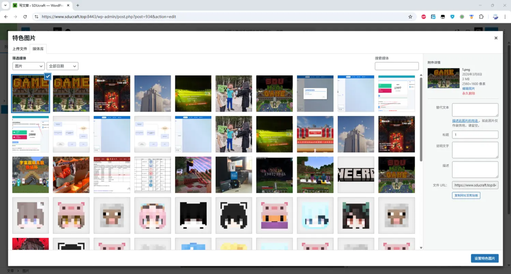

设置完成之后右下保存。  

搬运历史内容的同学还需要注意，搬运完成之后需要设置**发布时间**。因为我们搬运的文章往往早于现在时间，而文章列表会以发布时间为排序基准。如果不手动改发布时间，会全都变成这一天，观感不好。**需要手动改成当初那一天。**  

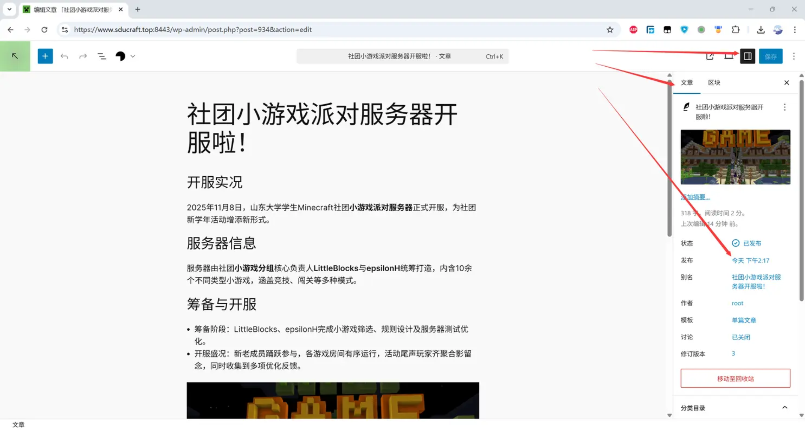

把这个时间改成这篇文章当初发布的时间，年月日对上，时分秒直接填12:00:00，美观统一。

## 7. 发布
这就算是完成了，最后点击页面右上角保存发布，确认发布，即成功。