# WordPress页面不完全开发指南

本文为WordPress（下文简称WP或wp）开发者可能所需要知道的一些知识和技巧的集合。  
如果你并不打算长期运维wp，可以跳过本文。
> @matcha: 当然 在你做一件事情（特别是更改）之前 请务必清楚你在做什么

## 一、代码编辑器

在写文章的时候我们通常用的是**可视化编辑器**，这便于对代码不甚了解的创作者写文章，但是作为开发者，可视化编辑器有时会不太方便我们进行更细微的控制，此时我们可能需要使用**代码编辑器**来对页面进行操作。  

随便打开一个页面，在右上角找到三个点，点开后即可看到“代码编辑器”。  

这里以“动态”页面为例：  

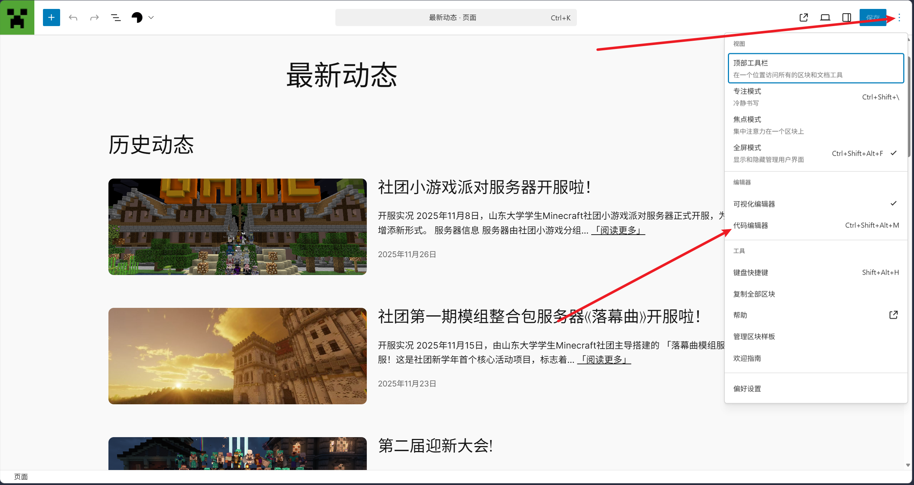

点击后我们就可以看到这个页面背后的代码：

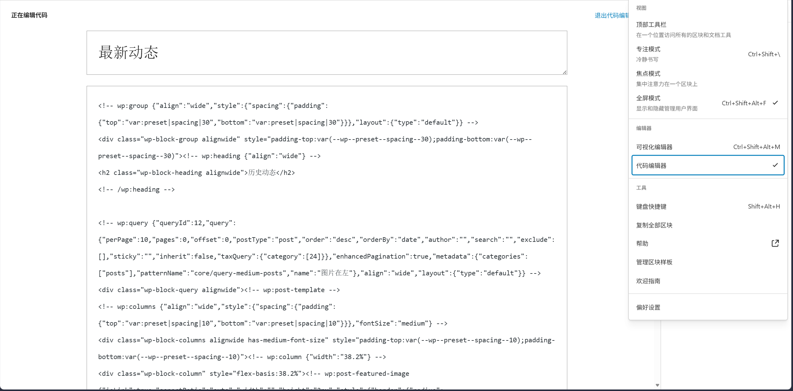

新版本wp用的是一种叫**Gutenberg**的编辑器，它所使用的代码语法是：
``` html
<!-- wp:query -->
<!-- wp:heading --> <!-- /wp:heading -->
```
与html注释的格式一致。  

本文我们不可能讲述完所有的区块自定义方式，仅讲几个开发过程中最常用和最重要的。  

如果需要了解更多区块的自定义用法，可以参考[WordPress Reference](https://developer.wordpress.org/reference/)  
以及WordPress服务器后台中的**wp-includes**文件夹，里面对每一个类都有相对完善的注释

### 1. WP_QUERY

WP_QUERY是WordPress官方的查询类，使用该查询可以查询，筛选WordPress后台中的文章和页面，
它在区块编辑器中的代码表示是：`<!-- wp:query -->`  

我们可以在之前打开的“动态”页找到一个WP_QUERY:
``` html
<!-- wp:query {"queryId":12,"query":{"perPage":10,"pages":0,"offset":0,"postType":"post","order":"desc","orderBy":"date","author":"","search":"","exclude":[],"sticky":"","inherit":false,"taxQuery":{"category":[24]}},"enhancedPagination":true,"metadata":{"categories":["posts"],"patternName":"core/query-medium-posts","name":"图片在左"},"align":"wide","layout":{"type":"default"}} -->
```
嗯。。WordPress似乎不是很愿意给我们看代码的人做缩进等等，所以可能需要我们自己缩进一下~~（或者你阅读代码能力足够好也可以硬啃）~~，这里为了方便讲解就做一下缩进了（之后如果有出现代码请自行缩进）：  
``` html
<!-- wp:query {
    "queryId":12,
    "query":{
        "perPage":10,
        "pages":0,
        "offset":0,
        "postType":"post",
        "order":"desc",
        "orderBy":"date",
        "author":"",
        "search":"",
        "exclude":[],
        "sticky":"",
        "inherit":false,
        "taxQuery":{"category":[24]}},
        "enhancedPagination":true,
        "metadata":{
            "categories":["posts"],
            "patternName":"core/query-medium-posts",
            "name":"图片在左"
        },
        "align":"wide",
        "layout":{"type":"default"}
    }
-->
```
这里的第一个参数`queryId`我们不用管，这是WordPress给查询自动生成的一个id，以防同一页面多个query相互影响。  
第二个参数`query`则是查询的核心，讲述了如何查询，查询什么，要筛选哪些字段等等等等。  
这里我们只讲几个重要的参数，之后会给出完整的参数列表：

 - `perPage`: 每页结果的数量
 - `pages`: 最大页数限制，0表示不限制
 - `offset`: 偏移，即跳过前面多少篇文章，比如设置成5则表示跳过查询最前面的5篇
 - `postType`: 查询类型，包含`post`(文章), `page`(页面)和其他自定义类型
 - `orderBy`: 按照什么字段排序，具体可查阅之后给出的参数列表。
 - `order`: 排序的顺序，`asc`: 升序 | `desc`: 降序
 - `search`: 关键字搜索
 - `exclude`: 排除指定id的结果，`[]`表示不排除
 - `sticky`: 对置顶文章的处理，`only`: 只显示置顶文章 | `exclude`: 不显示置顶文章 | `""` 按默认状态置顶（如果已有排序则不生效）
 - `taxQuery`: 包含一个taxQuery，其中：
   - `category`: 筛选的分类，这里24就是动态的分类id，如果有多个值则采用OR逻辑
 
<details>
<summary>完整的参数列表</summary>
此处提供英文原版注释，避免翻译出错导致理解混乱  

<pre><code class="language-php">
	/**
	 * Parses a query string and sets query type booleans.
	 *     @type int             $attachment_id          Attachment post ID. Used for 'attachment' post_type.
	 *     @type int|string      $author                 Author ID, or comma-separated list of IDs.
	 *     @type string          $author_name            User 'user_nicename'.
	 *     @type int[]           $author__in             An array of author IDs to query from.
	 *     @type int[]           $author__not_in         An array of author IDs not to query from.
	 *     @type bool            $cache_results          Whether to cache post information. Default true.
	 *     @type int|string      $cat                    Category ID or comma-separated list of IDs (this or any children).
	 *     @type int[]           $category__and          An array of category IDs (AND in).
	 *     @type int[]           $category__in           An array of category IDs (OR in, no children).
	 *     @type int[]           $category__not_in       An array of category IDs (NOT in).
	 *     @type string          $category_name          Use category slug (not name, this or any children).
	 *     @type array|int       $comment_count          Filter results by comment count. Provide an integer to match
	 *                                                   comment count exactly. Provide an array with integer 'value'
	 *                                                   and 'compare' operator ('=', '!=', '>', '>=', '<', '<=' ) to
	 *                                                   compare against comment_count in a specific way.
	 *     @type string          $comment_status         Comment status.
	 *     @type int             $comments_per_page      The number of comments to return per page.
	 *                                                   Default 'comments_per_page' option.
	 *     @type array           $date_query             An associative array of WP_Date_Query arguments.
	 *                                                   See WP_Date_Query::__construct().
	 *     @type int             $day                    Day of the month. Default empty. Accepts numbers 1-31.
	 *     @type bool            $exact                  Whether to search by exact keyword. Default false.
	 *     @type string          $fields                 Post fields to query for. Accepts:
	 *                                                   - '' Returns an array of complete post objects (`WP_Post[]`).
	 *                                                   - 'ids' Returns an array of post IDs (`int[]`).
	 *                                                   - 'id=>parent' Returns an associative array of parent post IDs,
	 *                                                     keyed by post ID (`int[]`).
	 *                                                   Default ''.
	 *     @type int             $hour                   Hour of the day. Default empty. Accepts numbers 0-23.
	 *     @type int|bool        $ignore_sticky_posts    Whether to ignore sticky posts or not. Setting this to false
	 *                                                   excludes stickies from 'post__in'. Accepts 1|true, 0|false.
	 *                                                   Default false.
	 *     @type int             $m                      Combination YearMonth. Accepts any four-digit year and month
	 *                                                   numbers 01-12. Default empty.
	 *     @type string|string[] $meta_key               Meta key or keys to filter by.
	 *     @type string|string[] $meta_value             Meta value or values to filter by.
	 *     @type string          $meta_compare           MySQL operator used for comparing the meta value.
	 *                                                   See WP_Meta_Query::__construct() for accepted values and default value.
	 *     @type string          $meta_compare_key       MySQL operator used for comparing the meta key.
	 *                                                   See WP_Meta_Query::__construct() for accepted values and default value.
	 *     @type string          $meta_type              MySQL data type that the meta_value column will be CAST to for comparisons.
	 *                                                   See WP_Meta_Query::__construct() for accepted values and default value.
	 *     @type string          $meta_type_key          MySQL data type that the meta_key column will be CAST to for comparisons.
	 *                                                   See WP_Meta_Query::__construct() for accepted values and default value.
	 *     @type array           $meta_query             An associative array of WP_Meta_Query arguments.
	 *                                                   See WP_Meta_Query::__construct() for accepted values.
	 *     @type int             $menu_order             The menu order of the posts.
	 *     @type int             $minute                 Minute of the hour. Default empty. Accepts numbers 0-59.
	 *     @type int             $monthnum               The two-digit month. Default empty. Accepts numbers 1-12.
	 *     @type string          $name                   Post slug.
	 *     @type bool            $nopaging               Show all posts (true) or paginate (false). Default false.
	 *     @type bool            $no_found_rows          Whether to skip counting the total rows found. Enabling can improve
	 *                                                   performance. Default false.
	 *     @type int             $offset                 The number of posts to offset before retrieval.
	 *     @type string          $order                  Designates ascending or descending order of posts. Default 'DESC'.
	 *                                                   Accepts 'ASC', 'DESC'.
	 *     @type string|array    $orderby                Sort retrieved posts by parameter. One or more options may be passed.
	 *                                                   To use 'meta_value', or 'meta_value_num', 'meta_key=keyname' must be
	 *                                                   also be defined. To sort by a specific `$meta_query` clause, use that
	 *                                                   clause's array key. Accepts:
	 *                                                   - 'none'
	 *                                                   - 'name'
	 *                                                   - 'author'
	 *                                                   - 'date'
	 *                                                   - 'title'
	 *                                                   - 'modified'
	 *                                                   - 'menu_order'
	 *                                                   - 'parent'
	 *                                                   - 'ID'
	 *                                                   - 'rand'
	 *                                                   - 'relevance'
	 *                                                   - 'RAND(x)' (where 'x' is an integer seed value)
	 *                                                   - 'comment_count'
	 *                                                   - 'meta_value'
	 *                                                   - 'meta_value_num'
	 *                                                   - 'post__in'
	 *                                                   - 'post_name__in'
	 *                                                   - 'post_parent__in'
	 *                                                   - The array keys of `$meta_query`.
	 *                                                   Default is 'date', except when a search is being performed, when
	 *                                                   the default is 'relevance'.
	 *     @type int             $p                      Post ID.
	 *     @type int             $page                   Show the number of posts that would show up on page X of a
	 *                                                   static front page.
	 *     @type int             $paged                  The number of the current page.
	 *     @type int             $page_id                Page ID.
	 *     @type string          $pagename               Page slug.
	 *     @type string          $perm                   Show posts if user has the appropriate capability.
	 *     @type string          $ping_status            Ping status.
	 *     @type int[]           $post__in               An array of post IDs to retrieve, sticky posts will be included.
	 *     @type int[]           $post__not_in           An array of post IDs not to retrieve. Note: a string of comma-
	 *                                                   separated IDs will NOT work.
	 *     @type string          $post_mime_type         The mime type of the post. Used for 'attachment' post_type.
	 *     @type string[]        $post_name__in          An array of post slugs that results must match.
	 *     @type int             $post_parent            Page ID to retrieve child pages for. Use 0 to only retrieve
	 *                                                   top-level pages.
	 *     @type int[]           $post_parent__in        An array containing parent page IDs to query child pages from.
	 *     @type int[]           $post_parent__not_in    An array containing parent page IDs not to query child pages from.
	 *     @type string|string[] $post_type              A post type slug (string) or array of post type slugs.
	 *                                                   Default 'any' if using 'tax_query'.
	 *     @type string|string[] $post_status            A post status (string) or array of post statuses.
	 *     @type int             $posts_per_page         The number of posts to query for. Use -1 to request all posts.
	 *     @type int             $posts_per_archive_page The number of posts to query for by archive page. Overrides
	 *                                                   'posts_per_page' when is_archive(), or is_search() are true.
	 *     @type string          $s                      Search keyword(s). Prepending a term with a hyphen will
	 *                                                   exclude posts matching that term. Eg, 'pillow -sofa' will
	 *                                                   return posts containing 'pillow' but not 'sofa'. The
	 *                                                   character used for exclusion can be modified using the
	 *                                                   the 'wp_query_search_exclusion_prefix' filter.
	 *     @type string[]        $search_columns         Array of column names to be searched. Accepts 'post_title',
	 *                                                   'post_excerpt' and 'post_content'. Default empty array.
	 *     @type int             $second                 Second of the minute. Default empty. Accepts numbers 0-59.
	 *     @type bool            $sentence               Whether to search by phrase. Default false.
	 *     @type bool            $suppress_filters       Whether to suppress filters. Default false.
	 *     @type string          $tag                    Tag slug. Comma-separated (either), Plus-separated (all).
	 *     @type int[]           $tag__and               An array of tag IDs (AND in).
	 *     @type int[]           $tag__in                An array of tag IDs (OR in).
	 *     @type int[]           $tag__not_in            An array of tag IDs (NOT in).
	 *     @type int             $tag_id                 Tag id or comma-separated list of IDs.
	 *     @type string[]        $tag_slug__and          An array of tag slugs (AND in).
	 *     @type string[]        $tag_slug__in           An array of tag slugs (OR in). unless 'ignore_sticky_posts' is
	 *                                                   true. Note: a string of comma-separated IDs will NOT work.
	 *     @type array           $tax_query              An associative array of WP_Tax_Query arguments.
	 *                                                   See WP_Tax_Query::__construct().
	 *     @type string          $title                  Post title.
	 *     @type bool            $update_post_meta_cache Whether to update the post meta cache. Default true.
	 *     @type bool            $update_post_term_cache Whether to update the post term cache. Default true.
	 *     @type bool            $update_menu_item_cache Whether to update the menu item cache. Default false.
	 *     @type bool            $lazy_load_term_meta    Whether to lazy-load term meta. Setting to false will
	 *                                                   disable cache priming for term meta, so that each
	 *                                                   get_term_meta() call will hit the database.
	 *                                                   Defaults to the value of `$update_post_term_cache`.
	 *     @type int             $w                      The week number of the year. Default empty. Accepts numbers 0-53.
	 *     @type int             $year                   The four-digit year. Default empty. Accepts any four-digit year.
	 * }
	 */
</code></pre>
</details>

---

### 2. WP_POST_TEMPLATE

这个是WordPress中所使用的文章模板类，Gutenberg代码为`<!-- wp:post-template -->`  

它本身并没有什么作用，但是它定义了一系列可以获取文章参数的函数，可以让我们很轻松的获取文章的一些要素，比如标题，时间，作者等等。它通常与查询区块结合使用。  

具体包含的方法/区块如下：
 - `<!-- wp:post-title -->`: 文章标题
 - `<!-- wp:post-date -->`: 发布时间/更新时间
 - `<!-- wp:post-author-name -->`: 作者名称
 - `<!-- wp:post-author-biography -->`: 作者简介
 - `<!-- wp:post-featured-image -->`: 特色图片
 - `<!-- wp:post-excerpt -->`: 文章摘要
 - `<!-- wp:post-content -->`: 文章正文
 - `<!-- wp:post-terms -->`: 分类/标签等
 - `<!-- wp:read-more -->`: 阅读更多链接
 - `<!-- wp:post-comments-link -->`: 评论链接
 - `<!-- wp:post-comments-count -->`: 评论数量
 - `<!-- wp:post-time-to-read -->`: 预计阅读时长

我们可以看看“动态”页面中查询后显示了哪些内容：
``` html
<!-- wp:post-template -->
<!-- wp:columns {"align":"wide","style":{"spacing":{"padding":{"top":"var:preset|spacing|10","bottom":"var:preset|spacing|10"}}},"fontSize":"medium"} -->
<div class="wp-block-columns alignwide has-medium-font-size" style="padding-top:var(--wp--preset--spacing--10);padding-bottom:var(--wp--preset--spacing--10)"><!-- wp:column {"width":"38.2%"} -->
<div class="wp-block-column" style="flex-basis:38.2%"><!-- wp:post-featured-image {"isLink":true,"aspectRatio":"auto","width":"","height":"2px","style":{"border":{"radius":{"topLeft":"10px","topRight":"10px","bottomLeft":"10px","bottomRight":"10px"}}}} /--></div>
<!-- /wp:column -->

<!-- wp:column {"width":"61.8%"} -->
<div class="wp-block-column" style="flex-basis:61.8%"><!-- wp:post-title {"isLink":true,"fontSize":"large"} /-->

<!-- wp:post-excerpt {"textAlign":"left","moreText":"「阅读更多」","showMoreOnNewLine":false,"excerptLength":75} /-->

<!-- wp:post-date {"metadata":{"bindings":{"datetime":{"source":"core/post-data","args":{"field":"date"}}}},"fontSize":"small"} /--></div>
<!-- /wp:column --></div>
<!-- /wp:columns -->
<!-- /wp:post-template -->
```

比较容易看出，这里面包含了文章的特色图片、文章标题、文章摘要以及文章发布日期。这也与最后页面显示的内容一致。

---

## 二、自定义样式及函数

代码编辑器固然已经足够强大了，但是有些操作即使是靠只编辑页面里的代码依旧没法很好的解决问题  

比如说要写一些比较通用的小组件，不可能每次都搬运大量的代码过去. 
抑或是需要定义全局的样式，也不可能在每个页面都重新修改，这样太费时间和精力……  

> 我们需要一个**全局**的位置存放这些**全局**的更改。 

此时我们可以在**主题文件编辑器**中写入自定义样式/函数/方法来进行全局的修改。  

在侧边栏中找到“工具”——“主题文件编辑器”

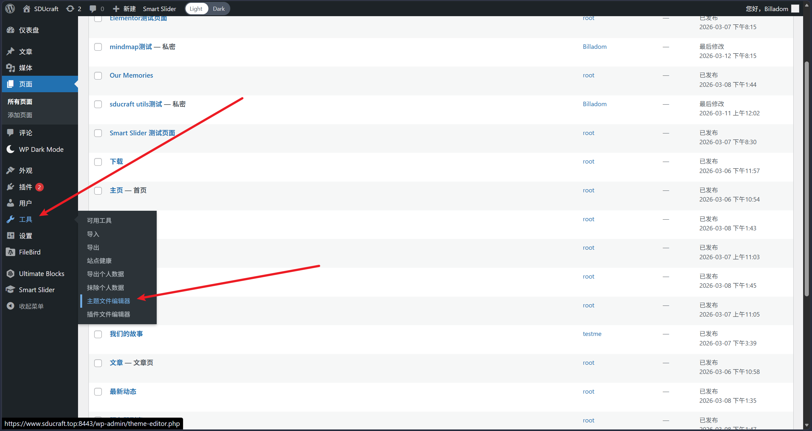

点开后就可以看到一堆主题文件。

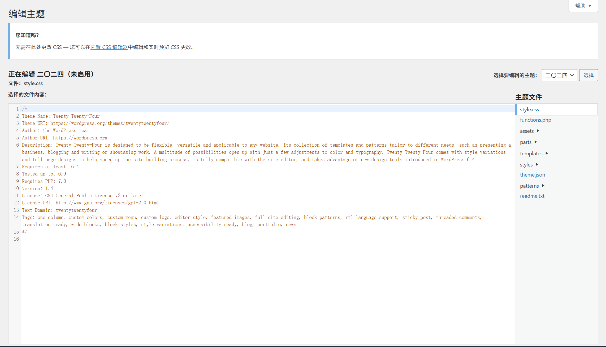

对于样式而言，我们可以在`style.css`进行添删改，也可以在wp内置的CSS编辑器更改，后者拥有实时的预览，相对更加方便。

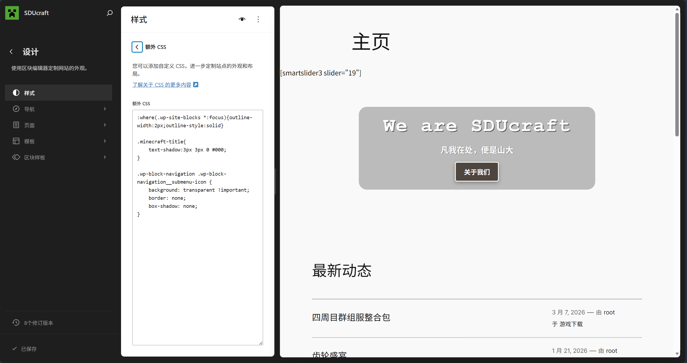

对于自定义函数，我们需要在`functions.php`中进行添加和修改  

点进去后我们就可以看到后台注册了许多的函数，方法，短代码，以及过滤器。  

由于篇幅原因这里无法详细解释每个函数的具体含义，对于php的一些基础函数请自行参考[教程](https://www.runoob.com/php/php-functions.html)  

我们这里讲一些常用的函数及其使用方法，并在每一个函数讲完后分析一个实现。  

---

### add_action

`add_action`用于添加一个“钩子”，即在某个时刻执行我们自己指定的函数，不需要设置返回值。  

`add_action`的使用方法是：`add_action(string $hook_name, callable $callback, int $priority=10, int $accepted_args=1);`  
其中包含了四个参数，分别是：
 - `hook_name`: 在哪个函数之后执行我们的函数
 - `callback`: 我们自己定义的函数，可以使用匿名函数，也可以使用函数名。
 - `priority`: 优先级。数字越小，执行越早。默认10。
 - `accepted_args`: 你要执行的函数接收几个参数？有些钩子会传递特定数据给你，此时可能需要对齐参数个数。默认1。

> 一般而言我们没必要手动设置优先级，除非你很明确你设置的函数需要有执行顺序。

让我们来看一个简单的示例：
``` php
add_action('init', function() {
	add_shortcode('filebird_list', function($atts) {
		$atts = shortcode_atts(array(
			'folder' => '其他',
		), $atts);
		return render_filebird_folder_list(array('folderName' => $atts['folder']));
	});
});
```

这里我们在`init`方法后添加了我们自己的一个方法，是添加了一个**短代码**，这样在初始化之后我们的短代码注册就成功被执行了。  

---

### add_shortcode

`add_shortcode`用于添加一个**短代码**（又称简码）。  

::: qa 不过，短代码是什么呢？
简单而言，短代码就是一种更容易调用的函数。  
但是它的返回值直接就是代码片段，原有短代码的位置会直接被**替换**成返回的代码。

我们可以很轻松的在文章和页面中调用它，只需要在编辑器中找到“简码”区块并插入，输入你使用的短代码即可。  

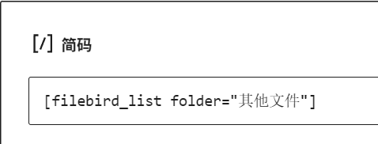

短代码的使用方式跟之前的区块类似，也有两种：
``` php
[tag]
[tag]content[/tag]
```
:::

`add_shortcode`的使用方法是：`add_shortcode(string $tag, callable $callback);`  

其中包含了两个参数：
 - `tag`: 你给简码起的名字。也就是在编辑器里输入的方括号里的词。例如`gallery`、`button`。
 - `callback`: 处理函数（又称回调函数）。当遇到你的简码时，wp会调用这个函数来生成要输出的内容。  

这里的处理函数也需要有自己的格式，如下：
``` php
function my_shortcode_handler( $atts, $content = null, $tag = '' ) {
    // ...
    return $output; // 返回字符串
}
```

这个处理函数有三个参数：
 - `$atts`: 一个数组，包含了短代码中所有添加的属性，比如：`[filebird_list folder="其他文件"]`中的`folder`属性
 - `$content`: 如果你采用了闭合式的短代码，那么用`$content`可以获取其中的内容。
 - `$tag`: 短代码的标签，如果你打算用一个函数来处理多个简码则可以使用。

让我们看看之前注册的短代码是怎么写的：
``` php
add_shortcode('filebird_list', function($atts) {
    $atts = shortcode_atts(array(
        'folder' => '其他',
    ), $atts);
    return render_filebird_folder_list(array('folderName' => $atts['folder']));
});
```

根据之前所说的，我们通过这个方法注册了一个名为`filebird_list`的简码。  
并且在回调函数中我们获取了一个为`folder`的属性，并设置了默认值为`其他`。  
在回调函数中我们的返回值是调用了另一个函数`render_filebird_folder_list`，你可以在`functions.php`中看具体实现。

---

### add_filter

`add_filter`的功能是注册一个**过滤器**。  

过滤器的核心作用是：拦截一个函数的返回值，在执行一定的操作后再返回定义的值。  

`add_filter`的使用方法是：`add_filter(string $hook_name, callable $callback, int $priority=10, int $accepted_args=1);`  
所有参数跟`add_action`一致，故不再赘述。  

> 不过需要注意，这里的回调函数需要返回跟原函数同类型的返回值，不然会导致未知的后果。

听着有点绕？不妨让我们先看个简单的例子理解一下：
``` php
add_filter('excerpt_length', function($length) {
    return 120;
}, 9999);
```

这里是一个简单的过滤器的例子，我们拦截了`excerpt_length`方法（就是决定文章概要长于多少字时自动截断的方法）的返回值，并将它设置为`120`并返回，这样默认文章概要会在120字之后截断。  
此外设置了优先级为`9999`，确保这个函数在最后执行，防止有其他的过滤器在它之后修改了这个值。  

看完了这个，我们可以来看一个略微复杂的过滤器。
``` php
add_filter('the_title', function($title, $id) {
	if (has_tag('archived', $id)) {
		return '<del style="text-decoration: line-through; color: #888; opacity: 0.7;">' . $title . '</del>';
	}

	return $title;
}, 10, 2);
```

这个过滤器修改的是`the_title`方法（即获取文章标题的方法），判断id对应的文章是否由`archived`的标签，如果有，那么我们给它加一个删除线的样式并返回，否则原封不动返回。这样就简单实现了一个给归档文章加删除线的效果。  
由于回调函数有两个参数，我们需要设置`accepted_args`为2。  

---

### 添加function的注释书写规范

现有的自定义方法都或多或少的拥有自己的注释，其中包含作者，简单的使用方法，部分方法会有一些注意事项和提示。  

如果你打算添加自定义函数，注释可以参考如下风格：
``` php
/**
 * @author 作者名字
 * ...(写下你实现的功能)
 * 示例: 使用你写的方法/过滤器/简码需要怎么实现。
 * @param 参数 参数的含义，如果有的话可以加。
 * @return 如果有返回值的话可以加进去，不加则有必要在前面“你实现的功能”中告诉使用者。
 * 
 * ...(一些提示和注意事项)
 */
```

## 三、插件

对于一些自定义要求更高的实现（比如注册自定义区块），即使是使用自定义函数有时也显得力不从心，此时可以使用插件来实现。  

### FileBird

该插件给媒体库提供了**逻辑**上的分类，使得对于媒体库中媒体文件的归类整理相对轻松。


对于想要分类的文件，可以直接在Uncategorized中找到它，并将其拖拽至你想要的分类中。  

在对应的文件夹下添加媒体文件会**自动**分到该文件夹。

> 请注意，同一个媒体只能存在于**一个分类**中，该分类前请务必思考会不会影响已有的分类情况。

#### FileBird Gallery（画廊）

FileBird 插件原生提供了`FileBird Gallery`区块，你可以在区块编辑器的“文字”分类下找到它。  

添加后可以选择文件夹，选择好后即可展示该文件夹下的所有图片。

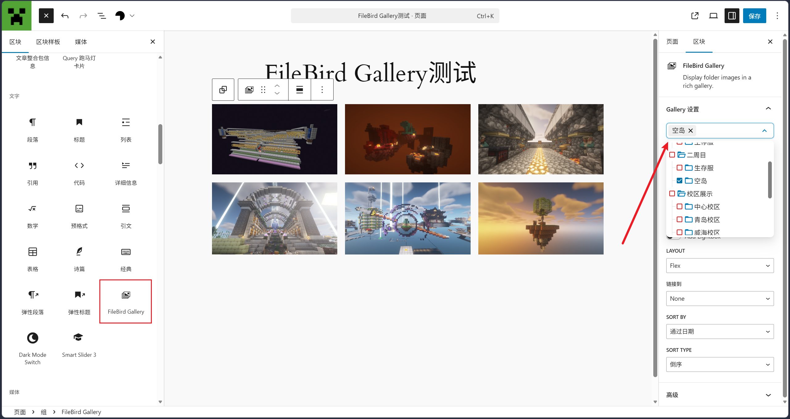

---

#### [filebird_list]

此外，还自定义了一个简码：`[filebird_list]`

它接受一个参数: `folder`，可以自行选择文件夹。  

设置好后则会显示一个该文件夹下所有文件的下载页面（预览状态无效）。

比如说：要想显示刚刚那个文件夹（“空岛”）的下载页，我们就可以设置成：
`[filebird_list folder="空岛"]`  
**不需要前置路径。**  

这样就会显示空岛下所有文件的下载页面（预览模式不生效）。

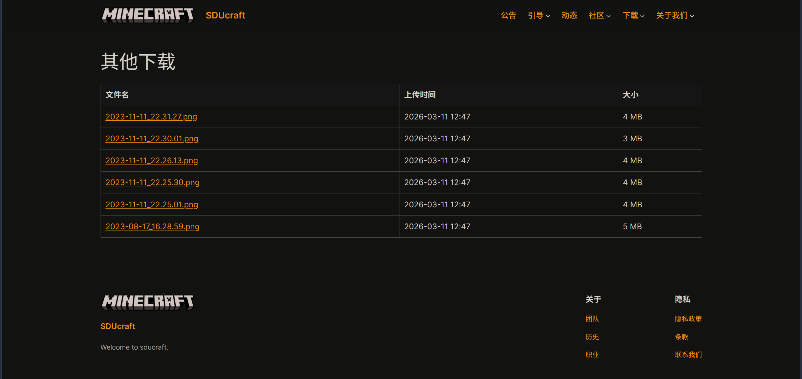

> 由于该短代码的实现写的较早，因此**未考虑同名文件夹的情况**，之后可能会二次维护。

---

### Smart Slider

该插件加入了一堆方便快捷的轮播图。  

你可以在仪表盘的侧边栏下方`Smart Slider`中找到它。  


这里面几乎囊括了所有新网站正在使用的轮播图（校区展示服，三周目，二周目，主页）  

点击“新建项目”即可新建一个轮播图，选中一个轮播图并点击“编辑”按钮即可编辑该轮播图。

#### 新建轮播图

一般情况而言，我们推荐直接使用模板来创建(Start with a Template)。

对于普通的轮播图，我们可以使用**Image Slider**。它相比直接从头创建方便很多，各个参数也很适合普通的轮播图。


点击左边的眼睛可以提前预览，点击Import按钮则会导入该模板。

里面的各项参数设置请自行研究，~~会者不难~~。记得如果有自动轮播的需求请打开“自动播放”。  
为了方便维护也请设置一下轮播图的名字和缩略图，减少之后寻找的成本。

---

#### 使用轮播图

~~客观来讲，导入后的页面已经很明确告诉你怎么使用了~~

有三种使用方式：
 - 简码。使用方式`[smartslider3 slider="21"]`，如何插入参考前面。
 - 可视化编辑器。你可以在区块编辑器中的“文字”板块找到`Smart Slider 3`，插入后选择想要轮播的轮播图即可。
 - PHP代码。请自行研究，一般情况下不用。


---

### SDUcraft Utils

当前官网使用的插件中，除了已在插件库中开源的插件外，还有一个内部（？）维护的`SDUcraft Utils`  

[临时Github仓库](https://github.com/Billadom0123/SDUcraft-Utils)


你可以在建设文章或页面的时候于可视化编辑器中看到它提供的组件：

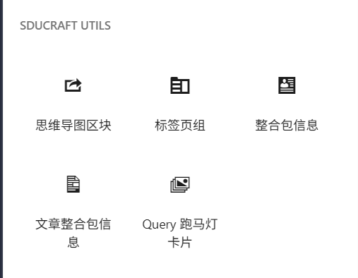

该插件中的组件无法保证没有bug，所以：

> 如果你遇到了bug，请提Issue，如果你有能力修复它，请直接提PR！

#### 思维导图

提供了一个将WordPress列表映射成思维导图的区块。  

插入后只需在列表内填写内容即可进行映射，不同的层级也会映射成对应的结构。  

编辑时点击右上角即可进行预览。

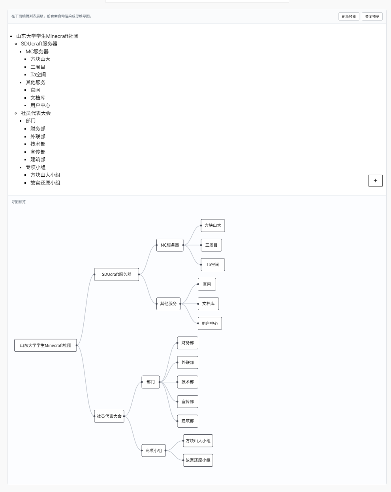

#### 标签页组

支持在多个标签页中进行切换。  

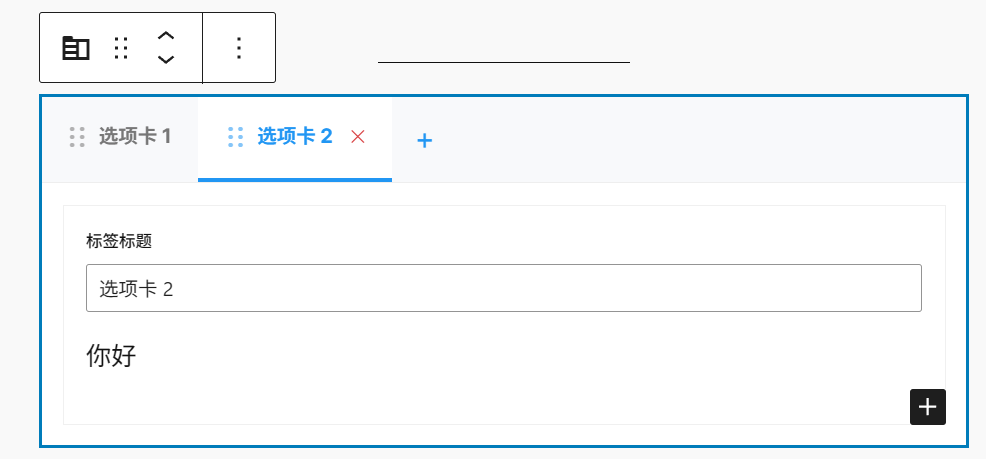

#### 整合包信息

支持快捷输入整合包的相关信息，~~还能预防有人太懒少写信息~~


#### 文章整合包信息

支持读取文章的第一个“整合包信息”区块并显示出来，支持多种显示形式。  
配合WP_QUERY效果更佳。  


#### 跑马灯

请自行研究，参数相对比较多。此处仅作效果展示：

